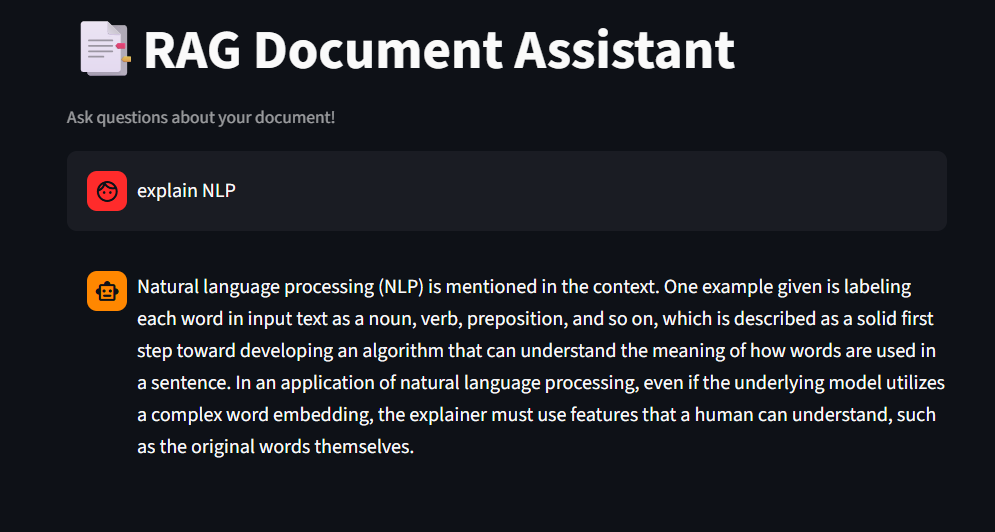

# 📑 RAG Document Assistant

An AI-powered document question-answering system built using **LangChain**, **HuggingFace Embeddings**, **ChromaDB**, and **Streamlit**.

Upload any document and ask questions — the system retrieves relevant context and answers using an LLM.

---

## 🌐 Live Demo
👉 [Try it live here](https://rag-documentassistant.streamlit.app/)

## 📸 Screenshots

### Chat Interface


### Document Q&A


---

## ✨ Features

- 📄 PDF document ingestion and processing
- 🔍 Semantic search using HuggingFace embeddings
- 🧠 MMR retrieval for diverse and relevant results
- 💬 Conversational chat interface
- ⚡ Fast and accurate answers from document context
- 🗄️ Persistent ChromaDB vector store
- 🔁 Duplicate chunk prevention using MD5 hashing

---

## 🛠️ Tech Stack

- Python
- Streamlit
- LangChain
- HuggingFace Embeddings (all-mpnet-base-v2)
- ChromaDB
- Groq API (Llama 3.3 70B)
- PyPDF

---

## 📂 Project Structure

```text
RAGProject/
│
├── .venv/
│
├── chroma-db/
│   ├── chroma.sqlite3
│   └── <uuid-folder>/
│
├── DocumentLoaders/
│   └── deeplearning.pdf
│
├── screenshots/
│   ├── demo1.png
│   └── demo2.png
│
├── .env
├── .env.example
├── .gitignore
├── app.py
├── dataIngestion.py
├── main.py
├── README.md
└── requirements.txt
```

---

## ⚙️ Installation

### 1️⃣ Clone the Repository

```bash
git clone https://github.com/bangarukondabollapally/rag-document-assistant.git
cd rag-document-assistant
```

### 2️⃣ Create Virtual Environment

```bash
python -m venv .venv
```

Activate:

#### Windows
```bash
.venv\Scripts\activate
```

#### Mac/Linux
```bash
source .venv/bin/activate
```

### 3️⃣ Install Dependencies

```bash
pip install -r requirements.txt
```

---

## 🔑 Environment Variables

Create a `.env` file:

```env
GROQ_API_KEY=your_groq_api_key
```

Get your free Groq API key at [console.groq.com](https://console.groq.com)

---

## 🚀 Usage

### Step 1 — Ingest your PDF

```bash
python dataIngestion.py
```

This will:
- Load and chunk the PDF
- Generate embeddings using HuggingFace
- Store in ChromaDB with duplicate prevention

### Step 2 — Run the app

```bash
streamlit run app.py
```

### Step 3 — Ask questions!

```
What is backpropagation?
Explain dropout in deep learning
What is a neural network?
```

---

## 🧠 How It Works

```
PDF Document
↓
PyPDFLoader → loads pages
↓
RecursiveCharacterTextSplitter → chunks (500 tokens, 100 overlap)
↓
HuggingFace Embeddings → converts chunks to vectors
↓
ChromaDB → stores vectors persistently
↓
MMR Retriever → fetches diverse relevant chunks
↓
Groq LLM → generates answer from context
↓
Streamlit UI → displays response
```

---

## 📦 requirements.txt

```text
streamlit
langchain
langchain-groq
langchain-huggingface
langchain-community
langchain-chroma
python-dotenv
pypdf
sentence-transformers
```

---

## 🔮 Future Improvements

- 📁 Multi-document support
- 🌐 Web URL ingestion
- 📊 Source citation with page numbers
- 🔎 Hybrid search (semantic + keyword)
- 🧾 Export Q&A as PDF report
- 🗂️ Document management UI

---

## 🚀 Deployment Note

This project uses local HuggingFace embeddings and ChromaDB.
Best run locally. For deployment, consider replacing with
cloud-based embeddings and vector stores.