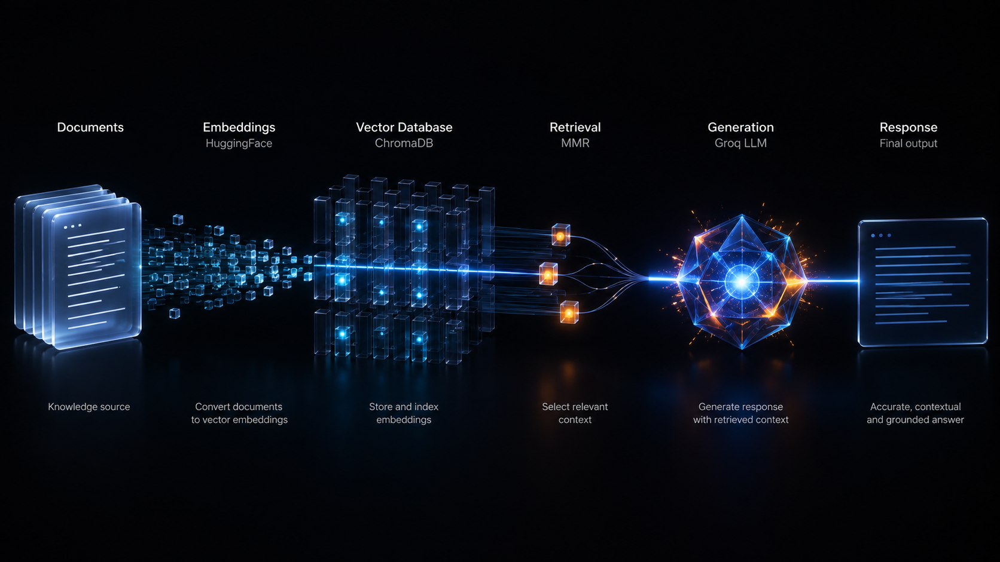
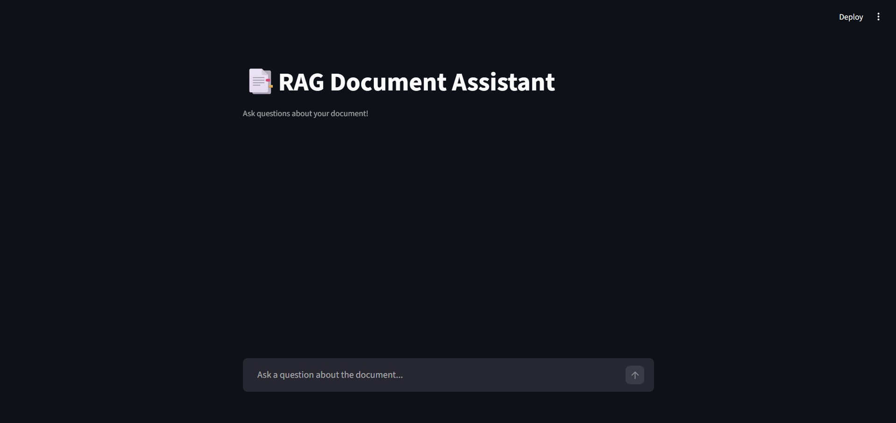

# 📑 RAG Document Assistant
An AI-powered document question-answering system built using **LangChain**, **HuggingFace Embeddings**, **FAISS**, and **Streamlit**.
Ask questions about any PDF document — the system retrieves relevant context and answers using an LLM.

---

## Visual Architecture


---

## 🌐 Live Demo
👉 [Try it live here](https://ragdocument-assistant.streamlit.app)

---

## 📸 Screenshots

### Chat Interface


### Document Q&A


---

## ✨ Features
- 📄 PDF document ingestion and processing
- 🔍 Semantic search using HuggingFace embeddings
- 🧠 MMR retrieval for diverse and relevant results
- 💬 Conversational chat interface
- ⚡ Fast and accurate answers from document context

---

## 🛠️ Tech Stack
- Python 3.11
- Streamlit
- LangChain
- HuggingFace Embeddings (all-mpnet-base-v2)
- FAISS
- Groq API (Llama 3.3 70B)
- PyPDF

---

## 📂 Project Structure
```text
rag-document-assistant/
│
├── DocumentLoaders/
│   └── deeplearning.pdf
│
├── assets/
│   ├── demo1.png
│   ├── demo2.png
│   └── rag.png
│
├── .env.example
├── .gitignore
├── app.py
├── runtime.txt
├── requirements.txt
└── README.md
```

---

## ⚙️ Installation

### 1️⃣ Clone the Repository
```bash
git clone https://github.com/bangarukondabollapally/rag-document-assistant.git
cd rag-document-assistant
```

### 2️⃣ Create Virtual Environment
```bash
python -m venv .venv
```

Activate:

#### Windows
```bash
.venv\Scripts\activate
```

#### Mac/Linux
```bash
source .venv/bin/activate
```

### 3️⃣ Install Dependencies
```bash
pip install -r requirements.txt
```

---

## 🔑 Environment Variables
Create a `.env` file:
```env
GROQ_API_KEY=your_groq_api_key
```
Get your free Groq API key at [console.groq.com](https://console.groq.com)

---

## ▶️ Run the Application
```bash
streamlit run app.py
```

Then ask questions like:
```
What is backpropagation?
Explain dropout in deep learning
What is a neural network?
```

---

## 🧠 How It Works
```
PDF Document
↓
PyPDFLoader → loads pages
↓
RecursiveCharacterTextSplitter → chunks (500 tokens, 100 overlap)
↓
HuggingFace Embeddings → converts chunks to vectors
↓
FAISS → stores vectors in memory
↓
MMR Retriever → fetches diverse relevant chunks
↓
Groq LLM → generates answer from context
↓
Streamlit UI → displays response
```

---

## 📦 requirements.txt
```text
streamlit
langchain
langchain-groq
langchain-huggingface
langchain-community
langchain-text-splitters
pypdf
sentence-transformers
faiss-cpu
```

---

## 🔮 Future Improvements
- 📁 Multi-document support
- 🌐 Web URL ingestion
- 📊 Source citation with page numbers
- 🔎 Hybrid search (semantic + keyword)
- 🧾 Export Q&A as PDF report
- 🗂️ Document management UI
